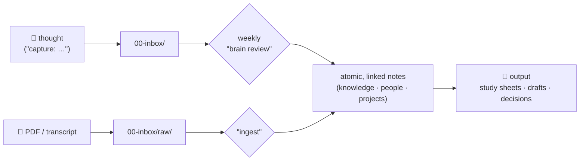

# 🧠 Brainwarden

**Brainwarden — a second brain that maintains itself.** An Obsidian vault and Claude
Code working on the same Markdown files: you dump thoughts with zero
friction — Claude turns them into atomic, linked notes, keeps the inbox
empty (one 10-minute ritual a week), and runs an onboarding interview so your brain knows you from
day one.

No plugins, no cloud service, no lock-in — just a folder of Markdown,
Git, and four Claude skills.

## Who this is for

- **Students** drowning in handouts, deadlines and exam dates — the brain
  becomes study sheets and a deadline memory.
- **Professionals & founders** juggling projects, people and decisions —
  the brain becomes project plans, drafts and an append-only decision log.
- **Anyone using Claude Code** who wants their AI to actually *know* them
  across sessions — not start from zero every conversation.
- **Obsidian-curious beginners** who never got past the empty vault: the
  onboarding interview fills it on day one, and the review keeps it alive.

You need exactly two things: a Claude subscription and ~35 minutes. You do
NOT need to know Markdown, Git, PARA or Zettelkasten — that's Claude's job.

## How it works

Three habits, nothing more: **capture** (anytime, formless) · **ingest**
(feed it sources) · **review** (weekly, inbox to zero — including a sweep
of what the week produced but nobody captured). Plus one power move:
**"research my brain"** — Claude takes the open questions and fills them
with verified, sourced facts.

## Quickstart

Prerequisites: [Obsidian](https://obsidian.md) (free) and
[Claude Code](https://claude.com/claude-code).

Open Claude Code (`claude` in your terminal) and say **one sentence**:

> Set up the second brain from this GitHub repo for me:
> https://github.com/nikolajhh2008-svg/brainwarden — clone it and
> follow SETUP-FOR-CLAUDE.md step by step.

Claude clones the kit itself, checks your prerequisites, and walks you
through setup + onboarding interview.

**Never used Obsidian or Claude Code?** → **[TUTORIAL.md](TUTORIAL.md)**
(zero to a running brain in 30 minutes, with checkpoints). Stuck?
→ [TROUBLESHOOTING.md](TROUBLESHOOTING.md).

## Two guides — one for you, one for your AI

| For | File | What it is |
|---|---|---|
| 🧑 **Human** | [TUTORIAL.md](TUTORIAL.md) | Zero to running brain in 30 min, with checkpoints |
| 🤖 **Claude** | [SETUP-FOR-CLAUDE.md](SETUP-FOR-CLAUDE.md) | The machine-readable setup runbook — **the repo is the installer** |

You only hand Claude the repo link — it clones, asks, adapts, installs.

## What the setup creates for you

- `~/Brain` with a flat, PARA-inspired base (inbox → projects → areas →
  knowledge → decisions → archive)
- **Your** areas and your first project — Claude asks about your life and
  names the folders in your words (a student gets different areas than a
  founder)
- **Your language** — the repo is English; your brain's content can live
  in German or any language you pick during setup
- Three installed skills (capture / ingest / review) + global rules so
  every future Claude session knows your brain
- An "About me" filled by the **onboarding interview** — optionally
  pre-filled by a consent-gated scan of your own computer ("may I look
  around to fill this in?") — plus people notes, deadlines, and a Git
  history from commit one

## Customizing (the numbering is expansion space)

The folder numbers have deliberate gaps: `00` inbox → `10` projects →
`20` areas → `30` knowledge → `40` decisions → … → `90` archive. The gap
between 40 and 90 is **reserved for your modules** — during setup (or any
time later) Claude offers opt-in extras that slot right in:

- `50-journal/` — daily/weekly journaling
- `60-media/` — reading & watch log
- `70-health/` — training, habits, metrics
- `80-money/` — budgets & financial decisions
- …or anything you name yourself

**Fixed** (skills depend on it): the six core folder names and the number
prefixes. **Free:** everything else — area names in your words, your
modules, your language, which templates you keep. Adding a module later
is one sentence: *"add a journal module to my brain."* Already have a
vault? The setup **adopts** your structure instead of overwriting it.

## What's inside

| Path | Contents |
|---|---|
| [`vault-template/`](vault-template/) | The complete vault: folder schema, rules ([CLAUDE.md](vault-template/CLAUDE.md)), templates, deterministic search tool |
| [`claude-skills/`](claude-skills/) | The four skills: `brain-capture` · `brain-ingest` · `brain-review` · `brain-research` |
| [`SETUP-FOR-CLAUDE.md`](SETUP-FOR-CLAUDE.md) | Step-by-step setup that Claude executes itself |
| [`INTERVIEW.md`](INTERVIEW.md) | The onboarding interview (7 blocks, 22 questions) |
| [`examples/`](examples/) | Style models (reference only — never copied into your vault) |
| [`PHILOSOPHY.md`](PHILOSOPHY.md) | Why it's built this way: the three ways second brains die, and the design answers |

## Principles

- **Atomic** — one idea = one note; people get individual notes; link everything.
- **File by actionability** — "which project/area needs this now?", never
  by topic taxonomy. Findability comes from links and search, not folder depth.
- **Zero-friction capture** — "capture: …" is enough; structure happens at
  review time, not capture time.
- **Processing duty** — the inbox goes to **zero** weekly (second brains
  die of full inboxes, not missing features).
- **The success metric is output** — texts, decisions, study sheets;
  never note count.
- **Append-only decisions** — decision records never get rewritten.
- **Deterministic search first** — `search.py` finds the relevant notes;
  Claude reads hits, not the whole vault (saves context).

## Contributing

Issues and pull requests welcome — see [CONTRIBUTING.md](CONTRIBUTING.md).
Changes: [CHANGELOG.md](CHANGELOG.md)

## License

[MIT](LICENSE) — take it, remix it, pass it on.

---

*Distilled from a real setup used daily: 100+ notes lived in first,
then reduced to a template. The reasoning behind every design choice:
[PHILOSOPHY.md](PHILOSOPHY.md).*
