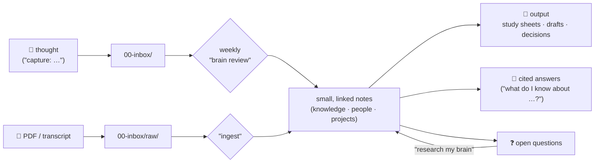

# 🧠 Brainwarden

[](LICENSE)
[](https://obsidian.md)
[](https://claude.com/claude-code)
[](https://github.com/nikolajhh2008-svg/brainwarden/actions/workflows/checks.yml)


**The easiest way to start a second brain. You talk, Claude does the
maintenance.**

A second brain is a folder of notes that remembers your life so you
don't have to: projects, deadlines, people, ideas. Most attempts at one
die because the filing and upkeep never happen. This kit hands that part
to Claude Code. The setup asks you three questions, then builds your
first real notes itself: your project, your deadlines, a living `Home`
dashboard. You never meet an empty vault.

No plugins, no cloud service, no telemetry. Just Markdown files, Git,
and five small Claude skills. Works with a brand-new vault or the one
you already have, wherever it lives.

## Quickstart

> Deutsch? Kurzanleitung in [LIESMICH.md](LIESMICH.md).

You need [Obsidian](https://obsidian.md) (free), a Claude subscription
with [Claude Code](https://claude.com/claude-code), and about 20
minutes. Open Claude Code (`claude` in your terminal) and say one
sentence:

> Set up the second brain from this GitHub repo for me:
> https://github.com/nikolajhh2008-svg/brainwarden — clone it and
> follow SETUP-FOR-CLAUDE.md step by step.

Claude clones the kit, checks your prerequisites, asks three questions,
and minutes later you open Obsidian to a brain that already contains
your first project and deadlines. A deeper onboarding interview comes
after that first win, and only if you want it.

This is what you land in — a real setup run, nothing mocked:


## Pick your path

- **Never used Obsidian or Claude Code?** [TUTORIAL.md](TUTORIAL.md)
  walks you from zero, with a checkpoint after every stage.
- **Terminal not your thing?** [Claudian](https://github.com/YishenTu/claudian)
  puts Claude Code directly inside Obsidian, next to your notes (its
  default settings give the agent broad permissions; tighten them for a
  personal vault). Or use the
  [Claude Code extension for VS Code](https://code.claude.com/docs/en/vs-code).
  Either way, paste the same Quickstart sentence there.
- **Comfortable with Claude Code?** The fast lane:
  ```bash
  git clone https://github.com/nikolajhh2008-svg/brainwarden
  cd brainwarden && claude "follow SETUP-FOR-CLAUDE.md step by step"
  ```
- **Already have a vault and just want the five skills?**
  ```
  /plugin marketplace add nikolajhh2008-svg/brainwarden
  /plugin install brainwarden@brainwarden
  ```
  Then tell Claude: *"adopt my existing vault at \<path\>, following
  brainwarden's SETUP-FOR-CLAUDE.md."* Nothing gets moved or
  overwritten; the skills follow a `Brain vault:` line in your global
  rules from then on.
- **Just browsing?** [`examples/`](examples/) shows what finished notes
  look like, right here on GitHub.

Stuck anywhere? [TROUBLESHOOTING.md](TROUBLESHOOTING.md).

## What actually happens

- You say *"capture: dentist Thursday 3pm, and Lena recommended that
  sleep book"*. Two inbox files appear instantly. Thursday lands in your
  Deadlines and on `Home`. At the weekly review the book becomes a small
  reference note and Lena's people note gets a line.
- You drop a 40-page PDF into the inbox and say *"ingest"*. If it feeds
  your exam or project, it comes back as small, linked study notes; if
  it's just a manual, it becomes one findable reference note. Claude
  always reports what went where.
- You ask *"what does my brain know about my thesis?"* and get an answer
  built only from your own notes, every claim a clickable link, plus an
  honest "here's what your brain doesn't know yet".

Five verbs cover everything: **capture** (anytime, formless), **ingest**
(feed it sources), **ask** (cited answers from your notes), **review**
(weekly: inbox to zero, catch what the week produced, deepen 2–3 thin
notes), **research** (fill open questions with verified, sourced facts).



## The one habit

You need exactly one habit: dump things into the brain. A sentence to
Claude, a file into the inbox, done. Filing, linking, deadline tracking,
weekly cleanup: Claude's job. Skip a few weeks and nothing breaks; the
next review catches up in batches, without guilt. Notes carry an honest
maturity marker (`seed`, `growing`, `evergreen`), and every review grows
a few thin ones toward real depth.

One firm rule protects all of it: **Claude gardens, it does not
author.** It files, links, reminds and researches, but the notes stay in
your words. The full reasoning behind every design choice, including the
four documented ways second brains die, is in
[PHILOSOPHY.md](PHILOSOPHY.md).

## Who this is for

Students drowning in handouts and exam dates. Professionals juggling
projects, people and decisions. Anyone using Claude Code who wants their
AI to actually know them across sessions. And Obsidian-curious beginners
who never got past the empty vault.

**Who it is NOT for:** if tags, search and relaxed standards already
keep your vault alive, you don't need this. If you want an AI to write
your thinking for you, this kit will refuse. And if you want maximum
features, look elsewhere; this is deliberately five skills and one
search script, because every extra command is one more thing a beginner
has to learn and trust.

## What's inside

| Path | Contents |
|---|---|
| [`vault-template/`](vault-template/) | The complete vault: folders, rules, `Home` dashboard, note templates, search tool |
| [`skills/`](skills/) | The five skills: capture · ingest · ask · review · research |
| [`SETUP-FOR-CLAUDE.md`](SETUP-FOR-CLAUDE.md) | The setup runbook Claude executes itself — the repo is the installer |
| [`TUTORIAL.md`](TUTORIAL.md) | The human-side guide, zero to running brain |
| [`PHILOSOPHY.md`](PHILOSOPHY.md) | Why it's built this way |

The folder numbering (`00-inbox` … `90-archive`) leaves gaps on
purpose: `50–80` are yours for optional modules like journaling, media
logs, health or money. Ask Claude to add one anytime; details in
[SETUP-FOR-CLAUDE.md](SETUP-FOR-CLAUDE.md).

## Privacy

Everything stays on your machine: notes in your vault, skills in
`~/.claude/skills/`, one opt-in block in `~/.claude/CLAUDE.md`. The kit
makes no network calls and has no telemetry. What Claude itself sends to
Anthropic is governed by your Claude Code settings, not by this kit.
Web research and the setup's optional computer scan run only with your
explicit consent. Uninstalling is three deletions:
[SECURITY.md](SECURITY.md).

## Contributing

Issues and pull requests welcome: [CONTRIBUTING.md](CONTRIBUTING.md).
Changes: [CHANGELOG.md](CHANGELOG.md). License:
[MIT](LICENSE).

---

*Distilled from a real, daily-used setup and tested from zero before
every release.*
