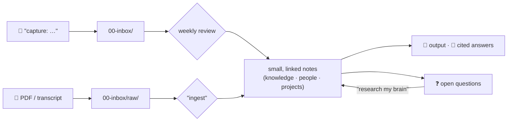

<div align="center">

# 🧠 Brainwarden

**The easiest way to start a second brain.**<br/>
You talk, Claude does the filing.

[](LICENSE)
[](https://obsidian.md)
[](https://claude.com/claude-code)

[Quickstart](#quickstart) · [Three kinds of brain](#three-kinds-of-brain) · [Built for agents](#built-for-agents-first) · [Tutorial](TUTORIAL.md) · [Deutsch](LIESMICH.md)

</div>


A second brain is a folder of notes that remembers your life so you don't
have to: projects, deadlines, people, ideas. Most attempts die because the
filing and upkeep never happen. This kit hands that part to Claude Code. It
asks which brain you want, then four short questions, then writes your
first real notes itself. **You never meet an empty vault.**

No plugins, no cloud service, no telemetry. Markdown files, Git, five small
Claude skills and three small Python scripts. Works with a brand-new vault or with
the one you already have, wherever it lives.

---

## Quickstart

You need [Obsidian](https://obsidian.md) (free), a Claude subscription with
[Claude Code](https://claude.com/claude-code), and about 20 minutes. Open
Claude Code (`claude` in your terminal) and say one sentence:

> Set up the second brain from this GitHub repo for me:
> https://github.com/nikolajhh2008-svg/brainwarden — clone it and follow
> SETUP-FOR-CLAUDE.md step by step.

Claude clones the kit, checks your prerequisites, asks its questions, and
minutes later you open Obsidian to a brain that already holds your first
project and your dates. The onboarding interview comes after that first
win, and only if you want it.

<div align="center">


*What you land in, from a real run.*

</div>

<details>
<summary><b>Other ways in</b> — no terminal, existing vault, or just the skills</summary>

<br/>

- **No terminal, and you want none?** Claude Code also comes as a desktop
  app for Mac and Windows — no black screen involved. And a finished vault
  can be read in [Claude Cowork](COWORK.md), where you just point at the
  folder: that is the way to hand a company vault to people who look things
  up rather than maintain them.
- **Never used Obsidian or Claude Code?** [TUTORIAL.md](TUTORIAL.md) walks
  you from zero, with a checkpoint after every stage.
- **Terminal not your thing?** [Claudian](https://github.com/YishenTu/claudian)
  puts Claude Code inside Obsidian (its defaults give the agent broad
  permissions; tighten them for a personal vault), or use the
  [Claude Code extension for VS Code](https://code.claude.com/docs/en/vs-code).
  Paste the same Quickstart sentence there.
- **Comfortable with Claude Code?** The fast lane:
  ```bash
  git clone https://github.com/nikolajhh2008-svg/brainwarden
  cd brainwarden && claude "follow SETUP-FOR-CLAUDE.md step by step"
  ```
- **Already have a vault and just want the five skills?**
  ```
  /plugin marketplace add nikolajhh2008-svg/brainwarden
  /plugin install brainwarden@brainwarden
  ```
  Then tell Claude: *"adopt my existing vault at \<path\>, following
  brainwarden's SETUP-FOR-CLAUDE.md."* Nothing is moved or overwritten.

Just browsing? [`examples/`](examples/) shows what finished notes look
like. Stuck anywhere? [TROUBLESHOOTING.md](TROUBLESHOOTING.md).

</details>

---

## Three kinds of brain

The first setup question decides the shape. A brain for yourself is the
main road; the rest are marked branches off it.

| You answer | You get |
|---|---|
| 🏠 **for me** | your life: projects, areas, knowledge, decisions, people |
| 💼 **for my work** | the same without the private half, plus your own runbooks, a log of what you actually did, and one field on every note: does this belong to you or to the employer |
| 🔀 **both, kept separate** | two vaults, two start commands (`claude` and `workbrain`), nothing crossing over |
| 🏢 **for a company** | shared knowledge for several people: processes, roles, onboarding, partners. No projects or areas, and roles instead of dossiers on colleagues |

**Why the work brain carries that one extra field.** In Germany and Austria
an employee has to hand over everything obtained from the employment when
they leave — courts count notes they wrote themselves about customer calls
and project work, copies included, with only genuinely private records
exempt. Mark each note as `private` or `company` while writing it and
leaving takes minutes. Sort it out on the last day and you cannot. The same
field decides what an agent may put into an external model.

The first win follows the same split: your first project and your dates,
plus the first workflow you wrote down in a work brain, or, after a few
extra questions, one procedure and the role that owns it in a company
brain (always its own vault, never a folder inside a private one).

---

## What actually happens

- You say *"capture: dentist Thursday 3pm, and Lena recommended that sleep
  book"*. Two inbox files appear instantly, Thursday lands in Deadlines and
  on `Home`, and at the weekly review the book becomes a small reference
  note while Lena's people note gets a line.
- You drop a 40-page PDF into the inbox and say *"ingest"*. Material you
  build on comes back as small, linked notes; a manual becomes one findable
  reference note. Claude always reports what went where.
- You ask *"what does my brain know about my thesis?"* and get an answer
  built only from your own notes, every claim a clickable link, plus an
  honest "here's what your brain doesn't know yet".

Five verbs cover everything: **capture** (anytime, formless), **ingest**
(feed it sources), **ask** (cited answers), **review** (weekly: inbox to
zero, deepen 2–3 thin notes), **research** (fill open questions).


```mermaid
flowchart LR
    A["💭 &quot;capture: …&quot;"] --> B["00-inbox/"] --> E{"weekly review"}
    C["📄 PDF / transcript"] --> D["00-inbox/raw/"] --> F{"&quot;ingest&quot;"}
    E --> G["small, linked notes<br/>(knowledge · people · projects)"]
    F --> G
    G --> H["🎯 output · 💬 cited answers"]
    G --> J["❓ open questions"] -- "&quot;research my brain&quot;" --> G
```

---

## Built for agents first

> The vault is a navigation system for AI agents before it is a note system
> for you.

Every folder that holds notes carries an `index.md`: what belongs there,
what does not, and the two or three notes worth starting from. Next to it,
a two-line `CLAUDE.md` pulls that signpost into Claude's context the
moment it reads any file in that folder. An agent that lands deep in your
vault through a search knows where it is without guessing, and a tool that
never heard of Claude still finds `index.md`. Same idea, three more places:

| | |
|---|---|
| **Two fields, two questions** | `maturity:` (`seed`, `growing`, `evergreen`) says how worked out a note is, `status:` (`draft`, `stable`, `deprecated`) whether it still holds. A note can be beautifully worked out and no longer true. |
| **`verified:` against `generated:`** | A human confirmed this, or a machine wrote it. Claude never sets `verified:` on its own work. In a company vault that field is the line between "this applies" and "this is a proposal". |
| **Replacements are written twice** | The new note says `Supersedes …`, the old one gets `Superseded by …` appended, so an agent landing in the outdated version finds the pointer instead of believing it. |

`.tools/hygiene.py` measures all of it: orphans, dead links, near-empty
notes, notes no signpost leads to, frontmatter gaps and one-sided supersede
chains. The weekly review runs it and fixes what it lists.

---

## The one habit

You need exactly one habit: **dump things into the brain.** A sentence to
Claude, a file into the inbox, done. Filing, linking, deadline tracking,
weekly cleanup: Claude's job. Skip a few weeks and nothing breaks; the next
review catches up in batches, without guilt. Knowledge notes carry an
honest `maturity:` marker, and every review grows a few thin ones deeper.

One firm rule protects all of it: **Claude gardens, it does not author.**
It files, links, reminds and researches; the notes stay in your words. The
reasoning, including the four documented ways second brains die, is in
[PHILOSOPHY.md](PHILOSOPHY.md).

---

## Who this is for

Students drowning in handouts and exam dates. Professionals juggling
projects, people and decisions. Small teams and family businesses whose
procedures live in one person's head. Anyone using Claude Code who wants
their AI to know them across sessions. And Obsidian-curious beginners who
never got past the empty vault.

Wondering whether a shared folder of Word files would do the same job?
[PHILOSOPHY.md](PHILOSOPHY.md) answers that one head-on — including the
cases where the answer is yes.

**Who it is NOT for:** if tags, search and relaxed standards already keep
your vault alive, you don't need this. If you want an AI to write your
thinking for you, this kit will refuse. If you need real access control
inside one company vault, this kit has none: separation means a separate
vault. And if you want maximum features, look elsewhere; this is
deliberately five skills and three small scripts.

<details>
<summary><b>What's inside</b> — the repo, folder by folder</summary>

<br/>

| Path | Contents |
|---|---|
| [`vault-template/`](vault-template/) | The vault core: folders, signposts, rules, `Home` dashboard, note templates, `.tools/` (search, hygiene, harvest) |
| [`vault-template/modules/`](vault-template/modules/) | Overlays copied on top for a work or company vault |
| [`skills/`](skills/) | The five skills: capture · ingest · ask · review · research |
| [`hooks/`](hooks/) | Optional: a net that catches what you forgot to capture |
| [`assemble.py`](assemble.py) · [`check.sh`](check.sh) | Build a vault in one command; measure the kit before you push |
| [`SETUP-FOR-CLAUDE.md`](SETUP-FOR-CLAUDE.md) | The setup runbook Claude executes itself, all three modes in one |
| [`TUTORIAL.md`](TUTORIAL.md) · [`PHILOSOPHY.md`](PHILOSOPHY.md) | The human-side guide, and why it's built this way |
| [`COWORK.md`](COWORK.md) | Reading the vault in Claude Cowork — what carries over, what does not |

The folder numbering (`00-inbox` … `90-archive`) leaves gaps on purpose. In
a private brain `50–80` are yours for optional modules like journaling,
media logs, health or money; a work brain takes the first two (`50-processes/`, `60-contribution/`); a company vault uses all four.

</details>

<details>
<summary><b>Privacy</b> — what stays on your machine, and what a second brain changes</summary>

<br/>

Everything stays on your machine: notes in your vault, skills in
`~/.claude/skills/`, one opt-in block in `~/.claude/CLAUDE.md`. A second
brain gets its own configuration directory (`~/.claude-work`, with its own
copy of skills and rules), which is what keeps work or company content out
of your private sessions.

The kit makes no network calls, has no telemetry, and logs nobody's
searches. What Claude sends to Anthropic is governed by your Claude Code
settings, not by this kit. Web research and the setup's optional computer
scan run only with your explicit consent. In a company vault,
`confidentiality:` is a label and not access control. Uninstalling is three
deletions, a few more with a second brain: [SECURITY.md](SECURITY.md).

</details>

---

<div align="center">

Issues and pull requests welcome: [CONTRIBUTING.md](CONTRIBUTING.md) · [CHANGELOG.md](CHANGELOG.md) · [MIT](LICENSE)

*Distilled from a real, daily-used setup, and tested from zero before it ships.*

</div>
